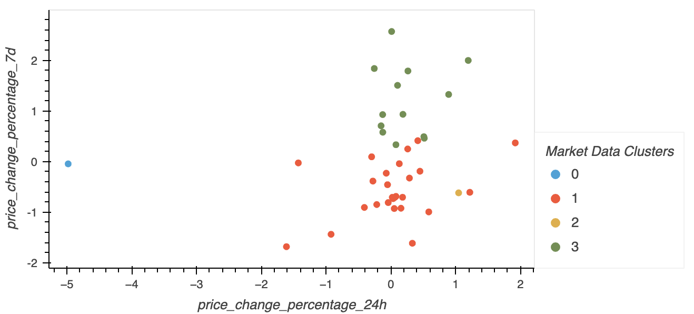
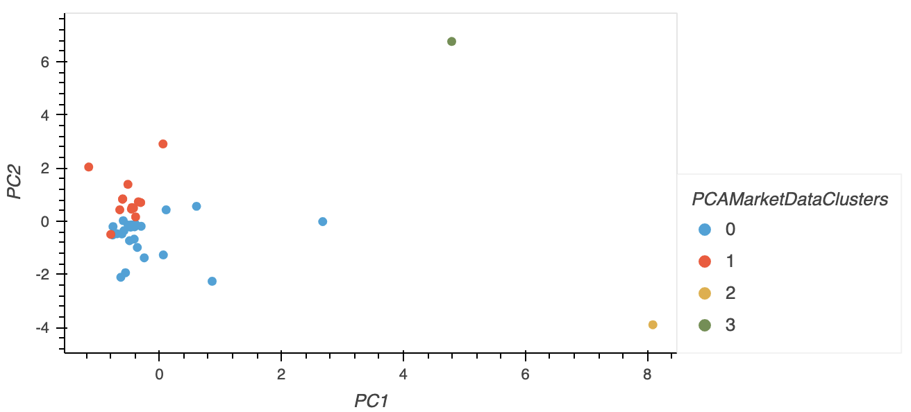
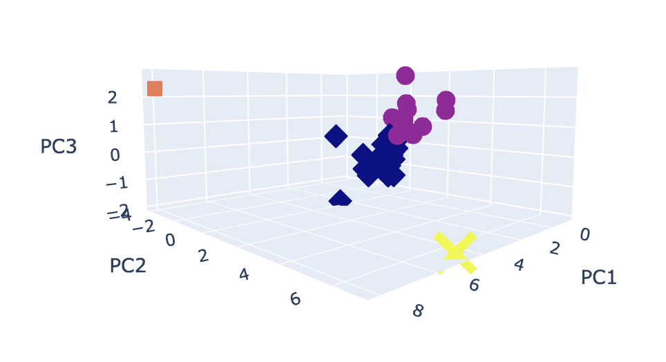

# CryptoClustering

## Overview

Predict if cryptocurrencies are affected by 24-hour or 7-day price changes. Using KMeans and optimizing with PCA, I will determine weather using fewer features changes the results of grouping. 

## Results

## Market Data Predictions

## PCA - Market Data Predictions

## PCA in 3-D - Market Data Predictions

## Summary

 We can conclude, using less features results in a similar performance to the original model as we can clearly identify four clusters. Visualizing in 3-D through plotly.express helps in understanding the PCA with three features.
